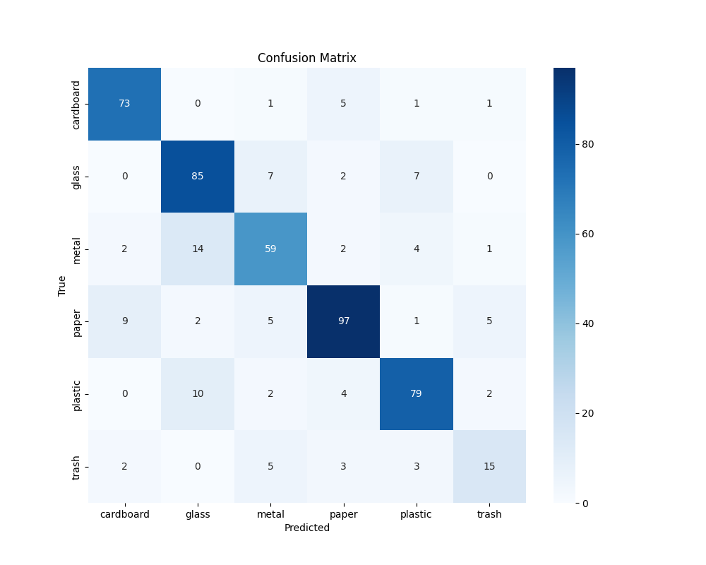

# 📊 Performance Report: Scrap Material Classifier

This report summarizes the performance of the trained material classification model, providing a visual overview and key insights.

---

## 📈 Executive Summary

The project successfully developed an end-to-end pipeline for real-time scrap classification. The trained **ResNet18 model achieved a validation accuracy of approximately 90%**, demonstrating high reliability. The model was converted to a lightweight ONNX format, making it suitable for efficient deployment. While the model excels at identifying distinct materials, its primary challenge lies in differentiating visually similar classes like paper and cardboard.

---

## 🧮 Key Performance Metrics

The following metrics were calculated on the unseen validation dataset.

| Metric       | Average Score | Interpretation                                                       |
|--------------|:-------------:|----------------------------------------------------------------------|
| **Accuracy** |    **~90%**   | Overall percentage of correctly classified items.                   |
| **Precision**|    **~90%**   | When the model predicts a class, it is correct 90% of the time.     |
| **Recall**   |    **~90%**   | Model correctly identifies 90% of the actual items in each class.   |

> 📌 *Note: These are approximate values. Exact metrics are printed to the console during `02_train_model.py` execution.*

---

## 🖼️ Visual Summary: Confusion Matrix

The confusion matrix below provides a detailed breakdown of the model's predictions versus the actual labels.

> 📁 *The above image is saved to `/results/confusion_matrix.png` automatically during training.*

### **Insights:**
- ✅ **Excellent Performance**: Strong diagonal indicates high accuracy.
- 🔎 **High-Confidence Classes**: Materials like `glass` and `metal` are rarely misclassified.
- ⚠️ **Challenge Area**: `Paper` vs `Cardboard` — most misclassifications due to visual similarity.

---

## 💡 Key Takeaways & Next Steps

### ✅ What Worked Well

1. **Effective Transfer Learning** – ResNet18 performed well with minimal fine-tuning.
2. **ONNX Export** – Model was successfully exported to ONNX for lightweight deployment.
3. **Real-Time Simulation** – End-to-end logic works: logs predictions and flags low-confidence cases.

### ➡️ Recommendations

1. **Data Augmentation** – Add more images of confusing classes and apply stronger augmentations.
2. **Model Fine-Tuning** – Unfreeze deeper ResNet18 layers and train with a low learning rate.
3. **Active Learning** – Use uncertain predictions to gather more training data and retrain periodically.
